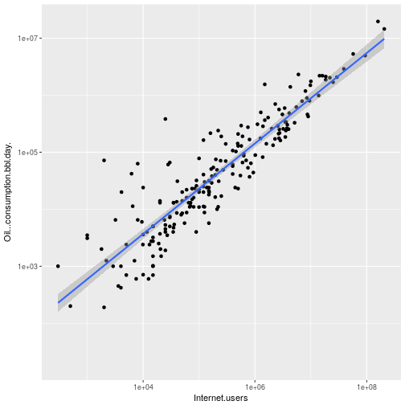
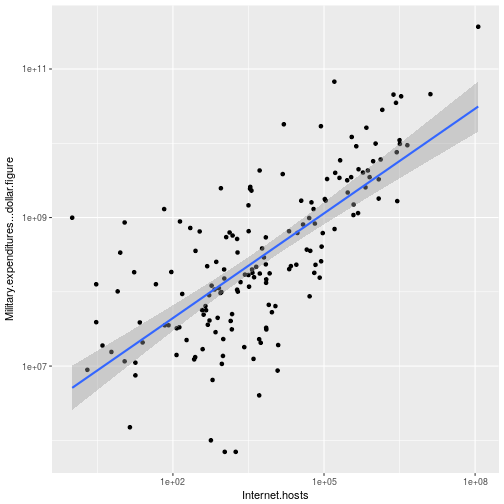
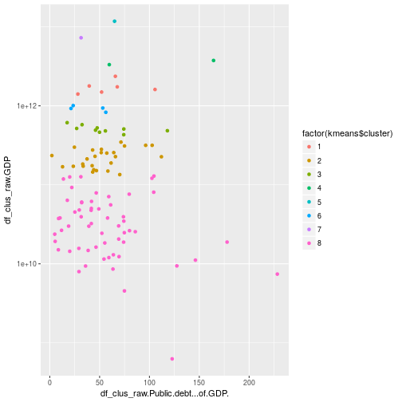

# Analysing data about countries

Brute force search for all correlations. A $R^2$ value larger than $0.9$ is
required.

```r
df = read.csv('factbook.csv', header=T, dec=".", na.strings="")
for (colx in names(df)) {
    if (colx == "Country") next
    for (coly in names(df)) {
        if (coly == "Country" || colx == coly) next
        tmp = data.frame(x=df[colx], y=df[coly])
        reg = lm(data=tmp)
        sum = summary(reg)
        if (sum$r.squared > 0.9) { print(colx); print(coly); print(sum$r.squared) }
    }
}
```

```
## [1] "Birth.rate.births.1000.population."
## [1] "Total.fertility.rate.children.born.woman."
## [1] 0.9663242
## [1] "Electricity...consumption.kWh."
## [1] "Electricity...production.kWh."
## [1] 0.9980941
## [1] "Electricity...consumption.kWh."
## [1] "GDP"
## [1] 0.9548228
## [1] "Electricity...consumption.kWh."
## [1] "Internet.users"
## [1] 0.9012045
## [1] "Electricity...consumption.kWh."
## [1] "Military.expenditures...dollar.figure"
## [1] 0.9101848
## [1] "Electricity...consumption.kWh."
## [1] "Oil...consumption.bbl.day."
## [1] 0.964507
## [1] "Electricity...consumption.kWh."
## [1] "Railways.km."
## [1] 0.9117701
## [1] "Electricity...production.kWh."
## [1] "Electricity...consumption.kWh."
## [1] 0.9980941
## [1] "Electricity...production.kWh."
## [1] "GDP"
## [1] 0.9621708
## [1] "Electricity...production.kWh."
## [1] "Internet.users"
## [1] 0.909739
## [1] "Electricity...production.kWh."
## [1] "Oil...consumption.bbl.day."
## [1] 0.9548504
## [1] "Electricity...production.kWh."
## [1] "Railways.km."
## [1] 0.9056952
## [1] "GDP"
## [1] "Electricity...consumption.kWh."
## [1] 0.9548228
## [1] "GDP"
## [1] "Electricity...production.kWh."
## [1] 0.9621708
## [1] "GDP"
## [1] "Internet.users"
## [1] 0.9599407
## [1] "GDP"
## [1] "Oil...consumption.bbl.day."
## [1] 0.9254179
## [1] "HIV.AIDS...deaths"
## [1] "HIV.AIDS...people.living.with.HIV.AIDS"
## [1] 0.9408944
## [1] "HIV.AIDS...people.living.with.HIV.AIDS"
## [1] "HIV.AIDS...deaths"
## [1] 0.9408944
## [1] "Highways.km."
## [1] "Oil...consumption.bbl.day."
## [1] 0.9048653
## [1] "Internet.hosts"
## [1] "Military.expenditures...dollar.figure"
## [1] 0.9401363
## [1] "Internet.users"
## [1] "Electricity...consumption.kWh."
## [1] 0.9012045
## [1] "Internet.users"
## [1] "Electricity...production.kWh."
## [1] 0.909739
## [1] "Internet.users"
## [1] "GDP"
## [1] 0.9599407
## [1] "Internet.users"
## [1] "Oil...consumption.bbl.day."
## [1] 0.9000771
## [1] "Labor.force"
## [1] "Population"
## [1] 0.9808368
## [1] "Military.expenditures...dollar.figure"
## [1] "Electricity...consumption.kWh."
## [1] 0.9101848
## [1] "Military.expenditures...dollar.figure"
## [1] "Internet.hosts"
## [1] 0.9401363
## [1] "Military.expenditures...dollar.figure"
## [1] "Natural.gas...consumption.cu.m."
## [1] 0.9194467
## [1] "Military.expenditures...dollar.figure"
## [1] "Oil...consumption.bbl.day."
## [1] 0.9459281
## [1] "Natural.gas...consumption.cu.m."
## [1] "Military.expenditures...dollar.figure"
## [1] 0.9194467
## [1] "Natural.gas...imports.cu.m."
## [1] "Oil...imports.bbl.day."
## [1] 0.9287649
## [1] "Oil...consumption.bbl.day."
## [1] "Electricity...consumption.kWh."
## [1] 0.964507
## [1] "Oil...consumption.bbl.day."
## [1] "Electricity...production.kWh."
## [1] 0.9548504
## [1] "Oil...consumption.bbl.day."
## [1] "GDP"
## [1] 0.9254179
## [1] "Oil...consumption.bbl.day."
## [1] "Highways.km."
## [1] 0.9048653
## [1] "Oil...consumption.bbl.day."
## [1] "Internet.users"
## [1] 0.9000771
## [1] "Oil...consumption.bbl.day."
## [1] "Military.expenditures...dollar.figure"
## [1] 0.9459281
## [1] "Oil...consumption.bbl.day."
## [1] "Oil...imports.bbl.day."
## [1] 0.9345638
## [1] "Oil...imports.bbl.day."
## [1] "Natural.gas...imports.cu.m."
## [1] 0.9287649
## [1] "Oil...imports.bbl.day."
## [1] "Oil...consumption.bbl.day."
## [1] 0.9345638
## [1] "Population"
## [1] "Labor.force"
## [1] 0.9808368
## [1] "Railways.km."
## [1] "Electricity...consumption.kWh."
## [1] 0.9117701
## [1] "Railways.km."
## [1] "Electricity...production.kWh."
## [1] 0.9056952
## [1] "Telephones...main.lines.in.use"
## [1] "Telephones...mobile.cellular"
## [1] 0.9587712
## [1] "Telephones...mobile.cellular"
## [1] "Telephones...main.lines.in.use"
## [1] 0.9587712
## [1] "Total.fertility.rate.children.born.woman."
## [1] "Birth.rate.births.1000.population."
## [1] 0.9663242
```

Plot some interesting (i.e. surprising) ones.

```r
ggplot(data=df, aes(x=Internet.users, y=Oil...consumption.bbl.day.)) + scale_x_log10() + scale_y_log10() + geom_point() + geom_smooth(method='lm')
```

```
## Warning: Transformation introduced infinite values in continuous y-axis

## Warning: Transformation introduced infinite values in continuous y-axis
```

```
## Warning: Removed 59 rows containing non-finite values (stat_smooth).
```

```
## Warning: Removed 59 rows containing missing values (geom_point).
```



```r
ggplot(data=df, aes(x=Internet.hosts, y=Military.expenditures...dollar.figure)) + scale_x_log10() + scale_y_log10() + geom_point() + geom_smooth(method='lm')
```

```
## Warning: Removed 99 rows containing non-finite values (stat_smooth).
```

```
## Warning: Removed 99 rows containing missing values (geom_point).
```




## Clustering

First, select some columns and remove `NA` values.

```r
df_clus_raw = df[
    !is.na(df$Public.debt...of.GDP.) &
    !is.na(df$GDP),
]
df_clus = data.frame(
    df_clus_raw$Public.debt...of.GDP.,
    df_clus_raw$GDP
)
# Check that not all countries are removed.
str(df_clus)
```

```
## 'data.frame':	108 obs. of  2 variables:
##  $ df_clus_raw.Public.debt...of.GDP.: num  37.4 118 17.4 64.2 18.9 63.8 43 96.2 8.6 52 ...
##  $ df_clus_raw.GDP                  : num  2.12e+11 4.84e+11 6.12e+11 2.56e+11 3.00e+10 ...
```

Try a clustering. Not really interesting.

```r
kmeans = kmeans(df_clus, 8)
ggplot(data=df_clus, aes(x=df_clus_raw.Public.debt...of.GDP., y=df_clus_raw.GDP, color=factor(kmeans$cluster))) + scale_y_log10() + geom_point()
```


